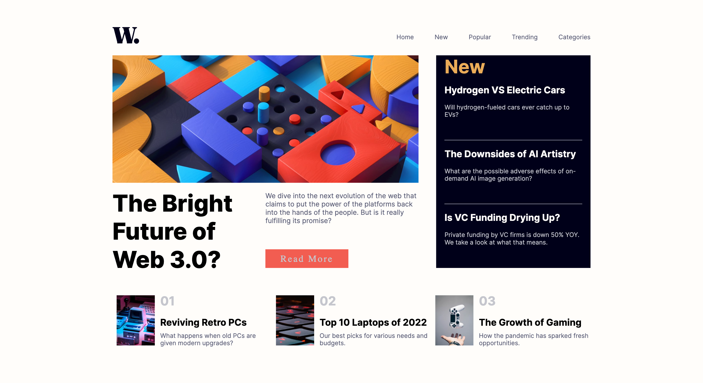

# Frontend Mentor - News homepage solution

This is a solution to the [News homepage challenge on Frontend Mentor](https://www.frontendmentor.io/challenges/news-homepage-H6SWTa1MFl). Frontend Mentor challenges help you improve your coding skills by building realistic projects. 

## Table of contents

- [Overview](#overview)
  - [The challenge](#the-challenge)
  - [Screenshot](#screenshot)
  - [Links](#links)
- [My process](#my-process)
  - [Built with](#built-with)
  - [What I learned](#what-i-learned)
  - [Continued development](#continued-development)
- [Author](#author)

**Note: Delete this note and update the table of contents based on what sections you keep.**

## Overview
This was a news webpage I built using html and CSS.  It was a good challenge, that wasn't too hard, but did stump me some.
Still have some questions but all in all I got it done.
### The challenge

Users should be able to:

- See hover and focus states for all interactive elements on the page

### Screenshot

### Links

- Solution URL: [Add solution URL here](https://github.com/gsquarles/newsHomepage.git)
- Live Site URL: [Add live site URL here](https://gsquarles.github.io/newsHomepage/)

## My process
So starting off I tried to envision in my head how I would organize this.  It seemed pretty straightforward in my head using grid,
however I still ran into some bumps.  I used grid to create some grids inside of grids to position items where they should be.
I thought to make a container to hold the whole sight and set the containers width and height to a certain vh and vw.  I thought by setting
them both to 80 and 85 it would make the site the size I wanted and centering it using grid.  It was working and I didn't have much trouble positioning
things.  Toward the end I had an issue with the bottomcontent, it should have been the second row of the main grid.  The height and width were set as 100% as well
but as soon as I would add an image and set it to 100% it didn't scale to fit the parent div.  It just overrode the div and made it a different size than I 
planned for.  So that is still my biggest question on why it wasn't working when every other div inherited there height from the parent with grid?
After that I realized the sit started to get to tall.  I wanted to be able to see it all with no scrolling, but it didn't stick to the original
height of the container I set.  This is something I need to figure out why.  So I scaled down the whole html a little to shrink it so it looked ok.
I didn't spend too much time on the mobile page as that was not what I wanted to work on at this time.
### Built with

- Semantic HTML5 markup
- CSS custom properties
- CSS Grid

### What I learned

I learned some tricks using grid and css during this.  Also how to put grids inside of grids to make more complex layouts.
I also improved some on using fractional or percentage units during this.  I still am unsure of when to use pixels instead though.

### Continued development

In the future I really want to understand margin and padding more.  I feel like I often use them at times I should not and it causes problems later on.
Also how to use grid-area.  I really want to understand why parents heights sometimes get changed if the item inside is bigger, although I set the child to be the
size of the parent div.  This caused problems often for me.  This happened with the container overflowing futher than and everything not fitting on the page without scrolling.  I don't know if this was due to me not making everything else smaller or what.  Same thing with the bottom content, the images would not shrink
to fit to 100% of the parent element.  So I had to use some really mess css to position it where I want.  Lastly getting more comfortable with h1 and others,
I often switched to divs instead, because the h1 tag had preset margins that I didn't like.

## Author

- Website - [Griffin Quarles](https://www.your-site.com)
- Frontend Mentor - [@gsquarles](https://www.frontendmentor.io/profile/gsquarles)

